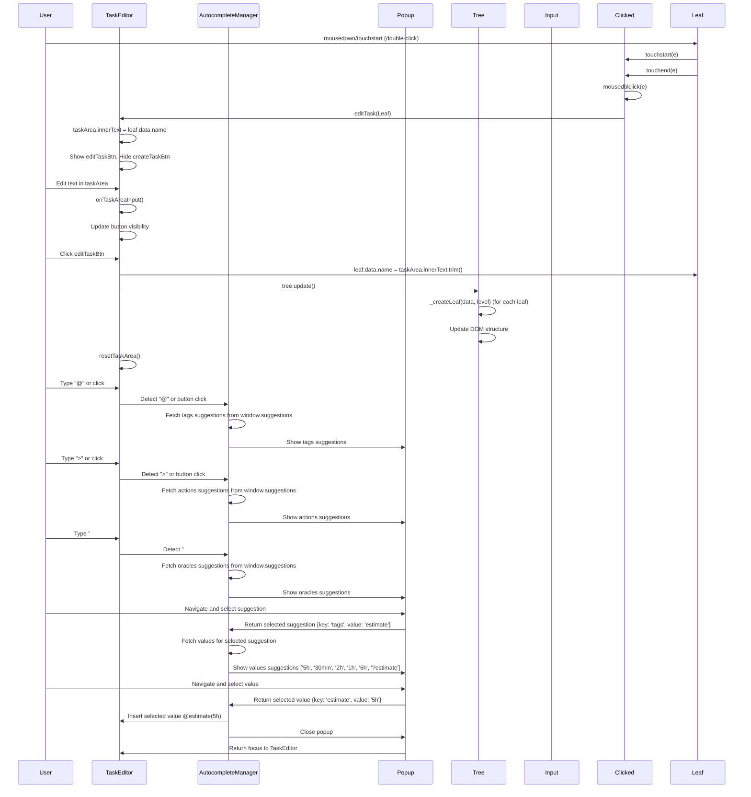
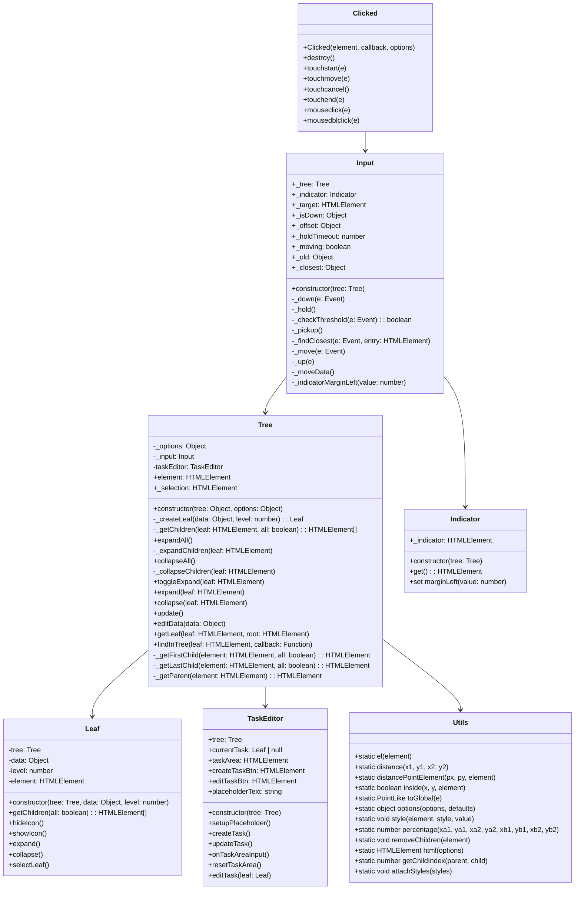

# Taskape Task Editor

A vanilla drag-and-drop UI tree for managing tasks, based on David Figatner's drag-and-drop UI tree.

## Autocomplete Manager Popup

### Sequence Diagram



### Workflow

#### Triggering the Popup:

When the user types "@" or clicks one of the designated buttons (`#addTags`, `#addActions`, `#addOracles`), the autocomplete popup appears inside the TaskEditor contenteditable area.
The popup initially shows the main categories (tags, actions, or oracles).

#### Selecting a Category:

If the user types a character after "@", the relevant category is automatically selected.
For example, typing "@t" will show the "tags" category first.
If a button is clicked, the popup directly shows the respective category.

#### Navigating Suggestions:

As the user continues typing, the popup updates to show the most relevant suggestions.
For instance, typing "@e" after selecting the "tags" category will prioritize the "estimate" property.

#### Selecting a Property:

The user can navigate the suggestions using the arrow keys.
Pressing "Enter" selects the highlighted suggestion.
Once a property (e.g., estimate) is selected, the popup displays the values related to that property.

#### Inserting a Value:

The user navigates through the values and selects one.
The selected value is inserted into the TaskEditor as `@property(value)`.

#### Removing a Tag:

The user can remove a tag by using backspace or delete on the span element.

### Example Usage

Typing "@":
1. User types "@" in the TaskEditor.
2. The popup shows categories: tags, actions, oracles.
3. User types "e".
4. The popup shows properties starting with "e", e.g., estimate under tags.
5. User selects estimate.
6. The popup shows values for estimate: ['5h', '30min', '2h', '1h', '6h', '?estimate'].
7. User selects 5h.
8. The value 5h is inserted into the TaskEditor as `@estimate(5h)`.

## Rationale

Taskape Task Editor is designed to provide an easy-to-use, drag-and-drop interface for managing hierarchical tasks without the need for frameworks like Vue or React.

## UML Class Diagram



## Super Simple Example
```js
const tasks = {
    task: [
        { 
            name: 'Do the laundry',
            task: [
                { name: 'Get the detergent', task: [] },
                { name: 'Sort the clothes', task: [] },
                { name: 'Put the clothes in the washing machine', task: [] },
                { name: 'Turn on the washing machine', task: [] }
            ] 
        },
        { 
            name: 'Do the dishes',
            task: [
                { name: 'Scrape the dishes', task: [] },
                { name: 'Rinse the dishes', task: [] },
                { name: 'Put the dishes in the dishwasher', task: [] },
                { name: 'Turn on the dishwasher', task: [] }
            ]
        }
    ]
};
```
