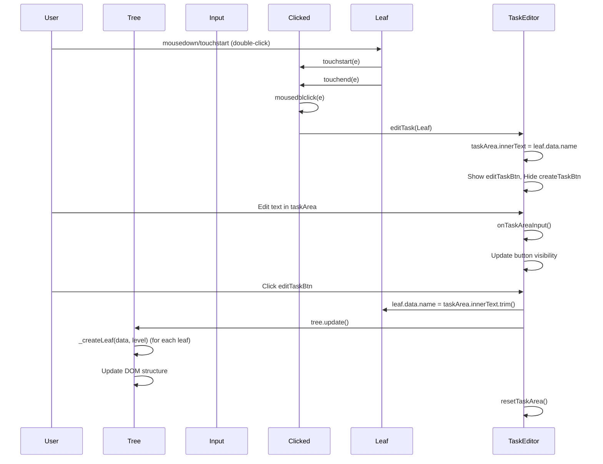
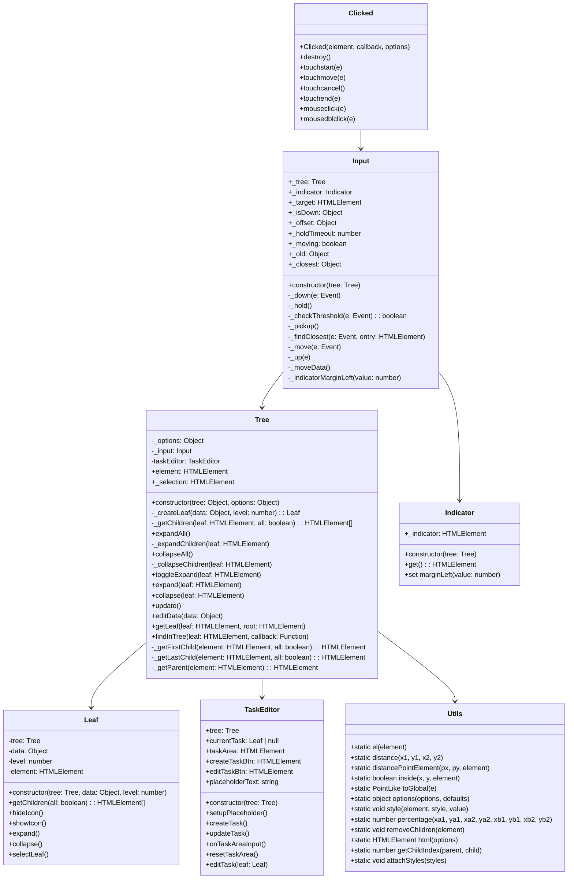

# Taskape Task Editor
A vanilla drag-and-drop UI tree for managing tasks, based on David Figatner's drag-and-drop ui tree

## Rationale
Taskape Task Editor is designed to provide an easy-to-use, drag-and-drop interface for managing hierarchical tasks without the need for frameworks like Vue or React.

## Interaction Diagram



## UML Class Diagram



## Super Simple Example
```js
const tasks = {
    task: [
        { 
            name: 'Do the laundry',
            task: [
                { name: 'Get the detergent', task: [] },
                { name: 'Sort the clothes', task: [] },
                { name: 'Put the clothes in the washing machine', task: [] },
                { name: 'Turn on the washing machine', task: [] }
            ] 
        },
        { 
            name: 'Do the dishes',
            task: [
                { name: 'Scrape the dishes', task: [] },
                { name: 'Rinse the dishes', task: [] },
                { name: 'Put the dishes in the dishwasher', task: [] },
                { name: 'Turn on the dishwasher', task: [] }
            ]
        }
    ]
};

const tree = new Tree(tasks, { parent: document.body, edit: true });
tree.expandAll();
```

## Features
- Drag-and-drop tasks
- Indentation for nested tasks
- Expand/collapse tasks
- Edit task names
- Add new tasks
- Delete tasks


## Tasks
Tasks are represented as a JavaScript object, where each task is an object with a `name` string and a `task` array of subtasks.


## License
Taskape Task Editor is released under the [MIT License](https://opensource.org/licenses/MIT).
```

## Credits
- [David Figatner] 